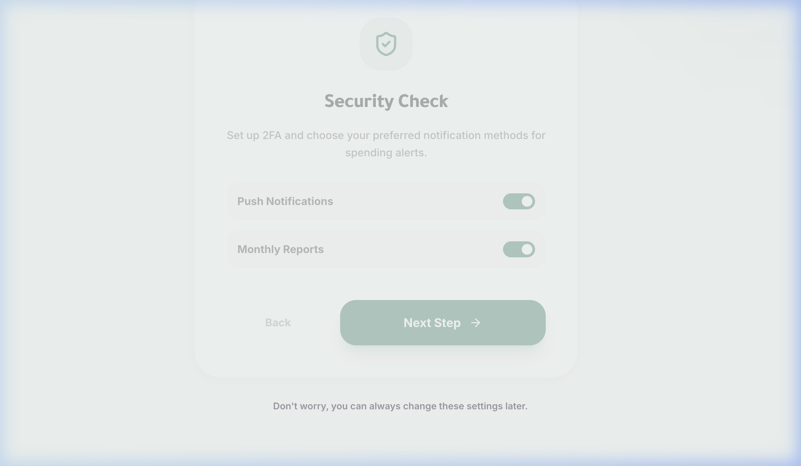

<p align="center">
  
</p>

<h1 align="center">The White Coin</h1>
<p align="center">
  <strong>AI-powered personal finance intelligence — built for clarity, driven by data.</strong>
</p>

<p align="center">
  
  
  
  
  
  
</p>

---

## 🔴 The Problem

Most people have no clear picture of where their money goes, whether they're on track for their goals, or what to do next. Traditional budgeting apps are rigid, generic, and require hours of manual input — and they still don't tell you *what to do*.

- ❌ No real-time financial health feedback
- ❌ No personalized goal planning
- ❌ No actionable AI advisor that understands *your* numbers
- ❌ No visibility into savings milestones and projected deadlines

---

## ✅ The Solution

**The White Coin** is an AI-first personal finance dashboard that builds a fully personalized financial plan through a conversational interface. It combines your real income, expenses, and savings goals with GPT-4o to:

- 📊 Generate a living financial plan with budget splits, goal timelines, and health scoring
- 💬 Allow natural language modifications ("Increase my savings to 500 JOD/month")
- 🎯 Track savings goals with real progress from the database — not AI guesses
- 🔄 Recalculate all deadlines and your health score on every modification
- 💡 Provide risk flags, recommendations, and a 12-month savings projection

---

## 🧱 Tech Stack

| Layer | Technology |
|---|---|
| **Backend Framework** | Laravel 13 (PHP 8.3) |
| **Authentication** | Laravel Sanctum (token-based SPA auth) |
| **Database** | SQLite (zero-config, file-based) |
| **AI Engine** | OpenAI GPT-4o via streaming SSE |
| **Frontend Framework** | React 19 + TypeScript 5 |
| **Build Tool** | Vite 6 + Laravel Vite Plugin |
| **Styling** | Tailwind CSS 4 |
| **Charts** | Recharts 2 |
| **Animations** | Motion (Framer Motion) |
| **Icons** | Lucide React |
| **API Layer** | Laravel Sanctum REST API |

### Key Models

| Model | Purpose |
|---|---|
| `User` | Auth, profile, and settings |
| `Transaction` | Expense tracking |
| `IncomeSource` | Monthly income records |
| `SavingsGoal` | Goals with target & current amounts |
| `Dependent` | Dependents (affects budget split logic) |
| `FinancialPlan` | Persisted AI plan + clarification history |

---

## 🚀 Getting Started

### Prerequisites

Make sure you have the following installed:

- **PHP** >= 8.3
- **Composer** >= 2.x
- **Node.js** >= 18.x & **npm** >= 9.x
- An **OpenAI API Key** (GPT-4o access required)

---

### 1. Clone the Repository

```bash
git clone https://github.com/your-username/the-white-coin.git
cd the-white-coin
```

---

### 2. Install PHP Dependencies

```bash
composer install
```

---

### 3. Configure Environment

```bash
cp .env.example .env
php artisan key:generate
```

Then open `.env` and fill in your OpenAI key:

```env
OPENAI_API_KEY=sk-your-openai-key-here
```

> The app uses **SQLite** by default — no database server needed.

---

### 4. Set Up the Database

```bash
touch database/database.sqlite
php artisan migrate
```

---

### 5. Install Frontend Dependencies

```bash
npm install
```

---

### 6. Start the Application

```bash
npm start
```

This single command runs **both** the Laravel backend and the Vite frontend concurrently:

- 🔵 **Laravel API** → `http://localhost:8000`
- 🟣 **Vite Dev Server** → `http://localhost:5173`

> Open your browser at **http://localhost:8000**

---

## 📁 Project Structure

```
the-white-coin/
├── app/
│   ├── Http/Controllers/Api/    # REST API controllers
│   ├── Models/                  # Eloquent models
│   └── Services/
│       └── FinancialPlanService.php  # GPT-4o streaming & plan generation
├── database/
│   └── migrations/              # DB schema
├── resources/
│   └── js/
│       ├── components/          # React UI components
│       │   ├── FinancialPlan.tsx    # Main plan page orchestrator
│       │   ├── PlanPanel.tsx        # Plan visualization (charts, goals)
│       │   ├── ChatPanel.tsx        # AI chat interface
│       │   ├── Dashboard.tsx        # Financial overview dashboard
│       │   └── ...
│       └── lib/
│           └── api.ts           # API client with SSE streaming support
├── routes/
│   ├── api.php                  # Sanctum-protected API routes
│   └── web.php                  # SPA catch-all route
└── public/
    └── assets/
        └── logo.png
```

---

## 🔑 Environment Variables

| Variable | Description | Required |
|---|---|---|
| `APP_KEY` | Laravel app encryption key (auto-generated) | ✅ |
| `OPENAI_API_KEY` | Your OpenAI API key for GPT-4o | ✅ |
| `DB_CONNECTION` | Database driver (default: `sqlite`) | ✅ |
| `APP_URL` | Base URL (default: `http://localhost:8000`) | ✅ |

---

## ✨ Features at a Glance

- **Conversational Plan Builder** — The AI asks 1–2 targeted questions before generating a complete financial plan
- **Live Plan Modification** — Send messages like "Swap my goal priorities" or "Add a vacation fund" and the plan updates in-place
- **50/30/20 Budget Analysis** — Needs, wants, and savings breakdown with automatic flag detection
- **12-Month Savings Projection** — Visual compound growth chart based on your actual numbers
- **Goal Progress Tracking** — Real saved balances pulled from the database, not estimated by AI
- **Round-Up Savings** — Automatically calculates micro-savings from transaction round-ups
- **Health Score** — 0–100 score recalculated on every plan modification

---

## 📄 License

MIT © The White Coin Team
